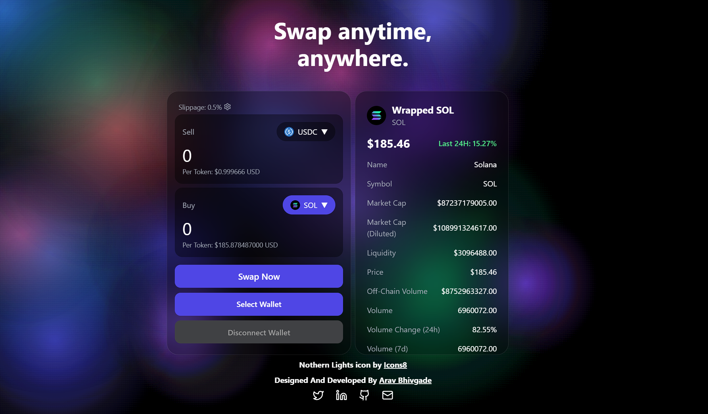

# Nebula Swap

**Nebula Swap** is a decentralized exchange (DEX) built for the Solana blockchain, enabling fast and efficient token swaps. Designed to bring ease and transparency to token exchanges, Nebula Swap provides real-time market data and accurate exchange rates, empowering users to make informed trading decisions.

## Key Features

- **Token Swap**: Seamlessly swap between Solana-based tokens with minimal fees and high transaction speed.
- **Market Data**: View real-time data for the token being bought, ensuring informed trading.
- **Exchange Rate**: Get precise exchange rates for any two selected tokens, assisting with value comparisons.
- **Price Per Token**: Check the price per token in USD for selected tokens, providing insights into value and market trends.

## Dependencies

Nebula Swap is powered by a range of robust tools and libraries:

- **Core Solana Libraries**:
  - `@solana/spl-token`
  - `@solana/web3.js`
  - `@project-serum/anchor`
  - `@solana/wallet-adapter` (Base, React, React UI, Wallets)

- **UI and Styling**:
  - `@radix-ui` (Dialog, Icons, Slider, Slot, Toast)
  - `tailwindcss` (with `tailwind-scrollbar` and `tailwindcss-animate`)
  - `lucide-react`
  - `clsx`
  - `tailwind-merge`
  - `class-variance-authority`

- **Data Handling**:
  - `axios` for API requests

- **React Framework**:
  - `react`, `react-dom`, `react-router-dom` for a responsive and interactive user experience.

## Getting Started

Nebula Swap is built using the **Vite** framework for fast development and builds, with a tailored development environment using ESLint and PostCSS for clean, efficient code. For development:

- Run `npm run dev` for a local development server.
- Use `npm run build` for production builds.

Explore the potential of decentralized exchanges with **Nebula Swap** on the Solana blockchain!
